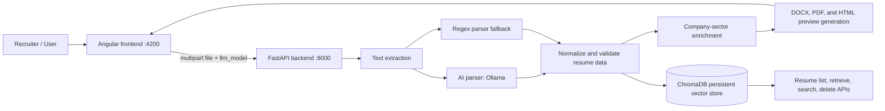

# Kanini Resume Builder: Project Flow, Functionality, and Implementation Guide

## 1. Project Purpose

Kanini Resume Builder is a web application that transforms a candidate resume into two standardized Kanini Word/PDF profile formats. A user uploads a PDF, DOCX, or legacy DOC resume, selects an optional local Ollama model, reviews two generated HTML previews, and downloads either output as DOCX or PDF.

The application also persists the full extracted resume as searchable vector data. This makes it possible for API consumers to list, retrieve, search, and delete stored resumes, although the current Angular screen exposes only the upload, preview, and download journey.

## 2. Primary Use Cases

1. **Convert a candidate resume:** Upload a supported resume and receive Template 1 and Template 2 in DOCX/PDF.
2. **Select an extraction model:** Choose automatic provider selection or a named Ollama model before upload.
3. **Review generated profiles:** Inspect scaled HTML previews before downloading.
4. **Download generated files:** Download either standard template as Word or PDF.
5. **Reuse stored resumes through the API:** Retrieve an earlier parsed resume and regenerate its templates after a backend restart.
6. **Find candidates semantically through the API:** Search persisted resumes using skills, experience, company, sector, projects, or similar natural-language terms.
7. **Extract skills only through the API:** Send a resume to the dedicated skills-only endpoint when complete generation is unnecessary.

## 3. System at a Glance



## 4. End-to-End Upload Flow

The normal browser journey is implemented as follows:

1. The user opens the Angular application at `http://localhost:4200`.
2. `FileUploadComponent` obtains available model options from `GET /api/llm-models`. If that request fails, it displays built-in Ollama choices.
3. The user drops or selects one file. The client accepts `.pdf`, `.docx`, and `.doc`; the screen text currently mentions only PDF and DOCX.
4. `AppComponent` sets its state to `uploading` and calls `ResumeService.uploadResume()`.
5. `POST /api/upload` checks the extension and rejects files larger than 10 MB.
6. The backend creates a UUID session directory under the operating system temporary folder, saves the uploaded source as `original.<extension>`, and extracts text.
7. For PDFs, the backend also runs the regex parser in parallel with the main parser because PDF layout extraction is less reliable. It may combine the cleaner skills and experience sections from both results.
8. The selected Ollama model parses raw text into structured JSON. If a strict model choice fails, the backend falls back to regex parsing; automatic mode requires a configured Ollama provider.
9. The backend cleans and normalizes summary text, experience fields, skills, education, projects, certifications, and achievements. It tries to repair common PDF extraction errors, including malformed section boundaries and title/company swaps.
10. The resume must contain readable text with at least one email address and one phone number. Otherwise the backend deletes the temporary upload and returns HTTP 422.
11. Each experience employer is enriched with a company-sector label. Existing ChromaDB mappings are preferred, followed by public web context plus Ollama classification, then a small hard-coded technology-company fallback map.
12. A rendering-only copy is created with all contact fields except the candidate name removed. This redacted copy is used for previews and downloads.
13. The backend creates two DOCX files, two PDF files, and two preview HTML strings. Generated output paths are held in the in-memory `SESSIONS` map.
14. The complete, non-redacted structured resume is stored in ChromaDB for later retrieval and semantic search.
15. The response returns the session ID, rendering-safe resume data, selected/requested model information, and both HTML previews.
16. Angular changes to the results screen, shows basic extraction counts, and sends the session/template/format to the download endpoint when the user clicks DOCX or PDF.

## 5. Frontend Behavior

The frontend is a standalone Angular 19 application. It has no router because the application is a three-state single-page workflow.

| State | Owner | What the user sees |
| --- | --- | --- |
| `idle` | `AppComponent` | Upload screen and model selector |
| `uploading` | `AppComponent` | Loading screen |
| `success` | `AppComponent` | Two template preview cards and downloads |

### Upload Screen

`FileUploadComponent` supports click-to-browse and drag-and-drop. It checks the client-side extension before emitting a file/model selection event. The server remains the authority for file type and file-size validation.

### Model Selector

The selector displays API-provided Ollama choices, grouped by provider. The backend currently implements only the `ollama` provider, even though `ai_parser.py` contains unused helper implementations for OpenAI, Azure OpenAI, Anthropic, and Gemini. The configured model requires `OLLAMA_BASE_URL`, `OLLAMA_HOST`, or `OLLAMA_MODEL`.

### Results and Downloads

`ResultsViewComponent` receives the upload response and creates one `TemplateCardComponent` per output format:

| Template ID | UI label | Backend generator | Download base name |
| --- | --- | --- | --- |
| `template1` | Kanini Format 1 | `generate_template1` | `Kanini_Format_Profile` |
| `template2` | Kanini Format2 | `generate_template_deloitte` | `Kanini_Format2_Profile` |

Each template card safely renders backend preview HTML after Angular's explicit sanitizer bypass, scales the fixed 780-pixel preview to its available width, and provides DOCX/PDF download controls. PDF downloads use `fetch()` to show an in-button loading state.

## 6. Backend API Contract

FastAPI publishes interactive API documentation at `http://localhost:8000/docs` while it is running.

| Method | Route | Purpose | Key behavior |
| --- | --- | --- | --- |
| `GET` | `/api/health` | Health probe | Returns `{ "status": "ok" }`. |
| `GET` | `/api/llm-models` | Model selector data | Returns model labels, values, provider details, and availability. |
| `POST` | `/api/upload` | Main conversion API | Multipart `file` plus optional `llm_model`; returns session, redacted render data, parser details, and previews. |
| `POST` | `/api/skills-only` | Skills extraction | Multipart `file`; parses with regex-only `parse_skill_set` and returns skills without storing a resume. |
| `GET` | `/api/resumes` | List persisted resumes | Returns lightweight records, newest first. |
| `GET` | `/api/resumes/search?q=<text>&n_results=5` | Semantic search | Returns best vector match per resume with a cosine similarity score. |
| `GET` | `/api/resumes/{resume_id}` | Retrieve stored resume | Regenerates preview/download artifacts and restores an active session. |
| `DELETE` | `/api/resumes/{resume_id}` | Delete stored resume | Deletes ChromaDB data and related temporary artifacts. |
| `GET` | `/api/download/{session_id}/{template_id}/{fmt}` | Download generated artifact | `template_id` is `template1` or `template2`; `fmt` is `docx` or `pdf`. |
| `DELETE` | `/api/session/{session_id}` | Delete current session | Removes temporary files, memory state, and the same ID from ChromaDB. |

### Upload Request

`multipart/form-data`

| Field | Required | Description |
| --- | --- | --- |
| `file` | Yes | Resume with `.pdf`, `.docx`, or `.doc` extension, maximum 10 MB. |
| `llm_model` | No | `auto` by default, or a value such as `ollama:qwen3:32b`. |

### Upload Response Shape

```json
{
  "session_id": "UUID",
  "resume_data": {
    "contact": { "name": "", "email": "", "phone": "", "location": "", "linkedin": "", "github": "" },
    "summary": "",
    "skills": { "Category": ["skill"] },
    "experience": [{ "title": "", "company": "", "location": "", "dates": "", "responsibilities": [] }],
    "education": [{ "degree": "", "institution": "", "year": "", "gpa": "" }],
    "certifications": [],
    "projects": [{ "name": "", "description": "", "technologies": [] }],
    "achievements": []
  },
  "llm_requested": "auto",
  "llm_used": "ollama:llama3.1",
  "preview_html": { "template1": "<div>...</div>", "template2": "<div>...</div>" }
}
```

`resume_data` in this response is the redacted rendering copy: its contact object contains only `name`. The full record, including extracted contact data, is retained in ChromaDB.

## 7. Parsing and Data Quality Pipeline

### Text Extraction

`backend/resume_parser.py` is responsible for file text extraction and regex parsing.

- **PDF:** tries PyMuPDF block extraction, pdfplumber text extraction, and pdfminer. It scores candidates to select the most structurally useful result. Table extraction and OCR with `pytesseract` are fallback paths, but `pytesseract` is not currently listed in `requirements.txt` and requires a local Tesseract installation.
- **DOCX:** extracts text through `docx2txt`.
- **DOC:** uses available local conversion/extraction handling in the parser; practical support depends on the host tools and document content.
- **PDF normalization:** repairs common encoding artifacts, joined headings, letter-spaced text, and stuck contact values before parsing.

### AI and Regex Parsing

`backend/ai_parser.py` defines the strict resume JSON schema and prompts the selected model to keep roles, companies, skills, and personal data in the correct fields. The active provider dispatch table contains only Ollama. `backend/resume_parser.py` provides the deterministic regex fallback and the separate skill-set parser.

### Normalization and Validation

`backend/main.py` owns the final quality controls. It cleans accidental bullet prefixes, attempts summary recovery, removes leaked experience fragments from skills, removes noisy projects, merges/deduplicates experience records, corrects title/company ordering when likely swapped, and validates readable content plus email and phone.

Set `PDF_PARSE_DEBUG=1` to write PDF extraction and parser diagnostics to `backend/pdf_parse_debug.log` and the backend console.

## 8. Template and PDF Generation

`backend/template_generator.py` creates every generated format.

1. `generate_template1()` creates the Kanini Format 1 DOCX.
2. `generate_template_deloitte()` creates the Format 2/Deloitte-style DOCX.
3. `generate_preview_html_template1()` and `generate_preview_html_deloitte()` produce browser preview HTML.
4. `convert_html_to_pdf()` renders PDF output from HTML using PyMuPDF.
5. `_inject_logo_into_html()` adds the Kanini logo only to downloadable PDF HTML. Logos are intentionally not added to browser previews.

The generator searches the repository and `frontend-ng/public/` for Kanini/Deloitte image files. Missing assets do not prevent generation; the output simply has no corresponding logo.

## 9. Persistence, Search, and Sessions

### Temporary Session Artifacts

The backend stores source uploads and generated artifacts in:

```text
%TEMP%\kanini_resume_builder\<session-id>\
```

`SESSIONS` is an in-memory Python dictionary containing generated file locations and the rendering-safe data. It is lost when the process restarts. Download requests can recover an earlier session only when its full resume still exists in ChromaDB.

### ChromaDB Data

`backend/vector_store.py` uses embedded, persistent ChromaDB at `backend/chroma_db/`. It lazily initializes collections using ChromaDB's default embedding function (the bundled `all-MiniLM-L6-v2` ONNX embedding model).

| Collection | Content and role |
| --- | --- |
| `resumes` | One vector row for each project, with common resume sections duplicated so project-aware semantic search is possible. Metadata includes the full `resume_json`. |
| `resume_section_index` | A row for each logical resume section and work-experience entry, used to reconstruct records when full metadata is unavailable. |
| `company_sector_index` | Reusable normalized company-to-sector mappings. |
| `sector_label_index` | Sector catalog populated through the seeding helper when called externally. |

`search_resumes()` returns the strongest matching project row for each candidate, converts cosine distance to a score with $score = max(0, 1 - distance)$, and sorts high to low.

## 10. Folder Structure and Responsibilities

```text
Template/
|-- backend/                         FastAPI service and processing pipeline
|   |-- main.py                      API routes, sessions, orchestration, validation, sector enrichment
|   |-- ai_parser.py                 Ollama model configuration, resume prompt, AI schema normalization
|   |-- resume_parser.py             PDF/DOCX/DOC text extraction and regex/skills parsers
|   |-- template_generator.py        DOCX templates, HTML previews, PDF creation, logo handling
|   |-- vector_store.py              ChromaDB persistence, vector rows, search, resume retrieval/deletion
|   |-- requirements.txt             Python dependencies
|   |-- analyze_*.py                 Developer analysis utilities for templates and Deloitte output
|   |-- create_test_resume.py        Test resume fixture generator
|   |-- test_*.py                    Script-style checks for parsing, previews, uploads, templates, and sections
|   |-- verify_bullets.py            Output bullet validation utility
|   `-- chroma_db/                   Runtime ChromaDB database; contains sensitive persisted resume data
|-- frontend-ng/                     Angular 19 single-page UI
|   |-- src/
|   |   |-- main.ts                  Angular bootstrap entry point
|   |   |-- styles.scss              Global styles
|   |   `-- app/
|   |       |-- app.component.*      Application state machine and page shell
|   |       |-- app.config.ts        Angular providers, including HTTP client
|   |       |-- components/
|   |       |   |-- file-upload/     File/model selection and drag-drop behavior
|   |       |   |-- loading-view/    Processing state display
|   |       |   |-- results-view/    Extraction summary and two-template layout
|   |       |   |-- template-card/   Scaled HTML preview and document download controls
|   |       |   `-- saved-resumes/   Saved-resumes component, currently not connected to the app shell
|   |       |-- models/resume.model.ts  TypeScript API payload contracts
|   |       `-- services/resume.service.ts  HTTP calls and configurable API base URL
|   |-- public/                      Browser-visible logos and file-type image assets
|   |-- proxy.conf.json              Development API proxy configuration
|   |-- angular.json                 Angular CLI build configuration
|   `-- package.json                 Node scripts and Angular dependencies
|-- DOCUMENTATION.md                 Earlier POC documentation; some statements are outdated
|-- PROJECT_FLOW_AND_IMPLEMENTATION.md  This current implementation guide
|-- setup.bat                        Creates backend venv and installs backend/frontend dependencies
|-- start.bat                        Starts backend and frontend development servers
|-- build_exe.bat                    Builds the packaged application
|-- run_build.cmd                    Unblocks files then invokes build_exe.bat
`-- KaniniResumeBuilder.spec         PyInstaller definition for packaging backend plus Angular distribution
```

## 11. Local Setup and Runbook

### Prerequisites

- Windows
- Python available through the `py` launcher
- Node.js 18 or later and npm
- An Ollama service reachable through `OLLAMA_BASE_URL` or `OLLAMA_HOST` for normal automatic uploads
- An Ollama model pulled locally, such as `llama3.1`, or a selected model such as `qwen3:32b`

### First-Time Setup

Run `setup.bat` from the repository root. It creates `backend/venv`, installs `backend/requirements.txt`, and runs `npm install` in `frontend-ng`.

### Configure the AI Provider

Set variables in the process environment or a `backend/.env` file:

```dotenv
OLLAMA_BASE_URL=http://localhost:11434
OLLAMA_MODEL=llama3.1
# Optional: AI_PROVIDER_PRIORITY=ollama
# Optional troubleshooting: PDF_PARSE_DEBUG=1
```

### Run in Development

Run `start.bat` from the root. It starts:

- FastAPI at `http://localhost:8000`
- Angular at `http://localhost:4200`
- Swagger/OpenAPI documentation at `http://localhost:8000/docs`

Alternatively, start each process manually:

```powershell
Set-Location backend
.\venv\Scripts\python main.py
```

```powershell
Set-Location frontend-ng
npm start
```

The frontend's `ResumeService` targets `http://localhost:8000` by default. A deployment can override it before Angular loads through `globalThis.__KANINI_API_BASE_URL__`.

### Build Frontend and Package

```powershell
Set-Location frontend-ng
npm run build
```

`main.py` serves the built Angular files when it finds `frontend-ng/dist/frontend-ng/browser` (or the related packaged paths). `run_build.cmd` invokes the PyInstaller build script, but the current `KaniniResumeBuilder.spec` contains hard-coded `D:\Templates\Template\...` paths and should be corrected for this repository location before repeatable packaging.

## 12. Error Handling and Operational Behavior

| Condition | Server result | Frontend behavior |
| --- | --- | --- |
| Unsupported extension | HTTP 400 | Toast notification. |
| File larger than 10 MB | HTTP 413 | Specific size toast. |
| No readable content, no email, or no phone | HTTP 422 | Invalid-resume toast. |
| Automatic mode without configured Ollama | HTTP 503 | Backend message shown in toast. |
| Named model unavailable/fails | Regex fallback normally proceeds | Results report parser usage in response, but UI does not display it. |
| PDF generation error | Download endpoint returns 500/504 | Browser retries as a direct download URL after fetch failure. |
| Server restart | In-memory session is lost | Downloads regenerate only when the matching record remains in ChromaDB. |

## 13. Known Gaps and Recommended Updates

The following improvements are recommended before treating the application as a production system. They are grouped by priority so requirements are concrete.

### High Priority: Security and Privacy

1. **Protect personal data at rest.** `backend/chroma_db/` stores full resume JSON including email and phone. Add an explicit data retention policy, encryption, access control, consent language, and an administrative purge process.
2. **Restrict CORS.** `main.py` currently permits every origin, method, header, and credential combination. Replace `allow_origins=["*"]` with approved frontend origins and remove credential support unless required.
3. **Add authentication and authorization.** Every API endpoint, including resume search, full resume retrieval, document download, and delete, is unauthenticated.
4. **Secure generated files and sessions.** Add server-side ownership checks, session expiration, background cleanup, and audit logging. Current UUIDs help but do not establish authorization.
5. **Review external company lookup.** Company names and resume-derived context can be sent to public web services and Ollama during sector classification. Make this opt-in, minimize the context, document it, and add timeouts/retries/caching policy.

### High Priority: Correctness and Resilience

6. **Make model/provider configuration internally consistent.** The parser has OpenAI/Azure OpenAI/Anthropic/Gemini implementations but exposes only Ollama in its provider map and dropdown. Either implement and test the advertised providers or remove inactive code and dependencies.
7. **Clarify fallback semantics.** The UI says unavailable models fall back to regex without error, but automatic mode deliberately returns HTTP 503 when no provider is configured. Present this distinction clearly to users and document which model actually parsed the file.
8. **Add real automated tests.** Current backend `test_*.py` files are script-style utilities rather than an evident pytest suite, and no Angular component/service tests are present. Add pytest and Angular/Karma tests for invalid files, parser fallback, redaction, API contracts, downloads, vector persistence, and UI error states.
9. **Harden DOC support.** Legacy `.doc` acceptance should be tested on clean machines and paired with a documented dependency or conversion strategy. Remove it from accepted extensions if reliable support cannot be guaranteed.
10. **Make OCR support complete.** Add the Python OCR package and document/install the Tesseract executable, or remove the implied scanned-PDF fallback. The current documentation should not promise OCR unless it is verified in deployments.
11. **Avoid blocking work in async routes.** Extraction, LLM calls, DOCX generation, PDF conversion, and ChromaDB work are CPU/blocking operations inside FastAPI request handling. Move them to a worker queue or thread/process execution with timeouts for reliable concurrent use.

### Medium Priority: Product Completeness

12. **Connect saved-resume capabilities to the UI.** The backend supports list/search/get/delete and `saved-resumes` exists as a component folder, but it is not imported or routed from `AppComponent`. Build a secured saved-resume view with search, open, delete, and clear privacy messaging.
13. **Add an edit/review step.** Users cannot correct parsed fields before documents are generated. Provide editable structured sections, validation, and a regenerate action; this is particularly important for resumes with complex tables or scanned PDFs.
14. **Display parse provenance.** Show the requested model, the parser actually used, fallback status, and warnings in the results screen. The API already returns `llm_requested` and `llm_used`.
15. **Improve frontend input messages.** Align the upload screen text with server support by saying PDF, DOCX, and DOC. Replace blocking `alert()` calls with the application's toast pattern.
16. **Handle browser-rendered HTML safely.** `TemplateCardComponent` uses `bypassSecurityTrustHtml`. Treat generated HTML as a trusted server-owned format only, sanitize it on the backend, and add tests proving candidate input cannot inject script/event attributes into previews.
17. **Provide PDF parity tests.** PDFs are generated from HTML while DOCX files are generated separately, so layout/content can drift. Add visual or text-based regression checks for both templates.

### Medium Priority: Maintainability and Delivery

18. **Replace hard-coded PyInstaller paths.** Make `KaniniResumeBuilder.spec` compute its repository-relative paths so another developer or CI agent can package the application.
19. **Pin and audit dependencies.** Several dependencies use broad minimum versions while others are fixed. Establish a lock/constraints file, vulnerability scanning, and periodic upgrades.
20. **Consolidate documentation.** `DOCUMENTATION.md` still describes GPT-4o-mini/OpenAI as the active parser, whereas current runtime routing is Ollama-only. Treat this file as historical or update it to link to this guide.
21. **Add CI.** Validate backend syntax/tests, Angular build/tests, formatting/linting, and a smoke upload using a non-sensitive fixture on every pull request.
22. **Add observability.** Use structured request logging, correlation/session IDs, metrics for parse duration/fallback/error rates, and redacted error telemetry. Do not log raw resume content or secrets.

## 14. Acceptance Requirements for a Production-Ready Version

A production iteration should be considered complete when it satisfies these measurable outcomes:

1. Authorized users can upload, edit, regenerate, preview, download, search, and delete only resumes they are permitted to access.
2. All stored candidate data has a documented retention period and can be removed completely by a permitted user or administrator.
3. Model selection clearly reports provider availability and the actual parser used; automatic fallback behavior is intentional and tested.
4. Supported file types, maximum sizes, scanned-PDF behavior, and privacy implications are communicated accurately in the UI and documentation.
5. Valid representative PDF, DOCX, and DOC samples produce both DOCX and PDF outputs, with test coverage for malformed files, missing contact information, parser failures, and download recovery.
6. The frontend offers a reviewed/editable representation before final output generation and exposes the stored-resume functionality where required.
7. Builds and tests run in CI without workstation-specific paths or manually installed hidden dependencies.

## 15. Key Implementation References

| Concern | Main implementation files |
| --- | --- |
| API orchestration, validation, artifacts, sessions | `backend/main.py` |
| Model integration and strict resume schema | `backend/ai_parser.py` |
| File extraction and deterministic parsing | `backend/resume_parser.py` |
| Document, preview, logo, and PDF output | `backend/template_generator.py` |
| Vector persistence and semantic retrieval | `backend/vector_store.py` |
| Angular state transitions | `frontend-ng/src/app/app.component.ts` |
| API requests and deployment base URL | `frontend-ng/src/app/services/resume.service.ts` |
| Upload/model selector | `frontend-ng/src/app/components/file-upload/` |
| Preview and download implementation | `frontend-ng/src/app/components/results-view/` and `frontend-ng/src/app/components/template-card/` |

This document describes the repository's current implementation as of 2026-08-31. It should be updated alongside any changes to API routes, parsing providers, storage policy, output templates, or deployment model.