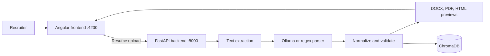

# Kanini Resume Builder

Kanini Resume Builder converts a candidate resume into two code-defined Kanini profile formats. Upload a PDF, DOCX, or DOC resume, review/edit canonical data, choose a template, preview it, and download HTML, DOCX, or PDF.

The application consists of an Angular 19 single-page frontend and a FastAPI backend. Parsed resumes are also retained in a local ChromaDB vector store for API-based retrieval and semantic search.

## What It Does

- Upload resumes up to 10 MB in PDF, DOCX, or DOC format.
- Extract and normalize contact details, summary, skills, experience, education, projects, certifications, and achievements.
- Use a selected local Ollama model when available, with deterministic parsing fallback where applicable.
- Render Kanini Format 1 and Kanini Format 2 through dedicated HTML, DOCX, and XeLaTeX/PDF renderers.
- Redact contact details from browser previews and downloaded profiles, retaining only the candidate name.
- Persist the full parsed record locally for listing, retrieval, semantic search, regeneration, and deletion through the API.

## Architecture



## Prerequisites

- Windows
- Python available through the `py` launcher
- Node.js 18 or later with npm
- An Ollama service and a locally pulled model for AI-assisted parsing, for example `llama3.1`

AI-assisted uploads require an Ollama endpoint. Configure it in the process environment or create `backend/.env`:

```dotenv
OLLAMA_BASE_URL=http://localhost:11434
OLLAMA_MODEL=llama3.1
```

## Quick Start

From the repository root, install the backend and frontend dependencies:

```powershell
.\setup.bat
```

Start both development servers:

```powershell
.\start.bat
```

Open the application at `http://localhost:4200`. The FastAPI OpenAPI documentation is available at `http://localhost:8000/docs`.

### Run Services Manually

Backend:

```powershell
Set-Location backend
.\venv\Scripts\python main.py
```

Frontend:

```powershell
Set-Location frontend-ng
npm start
```

## User Flow

1. Upload a supported resume and optionally select an Ollama model.
2. The backend extracts text, parses it into structured resume data, validates email and phone presence, and enriches experience employers with sector labels.
3. Review/edit resume data, select one registered template, and view its dedicated HTML preview.
4. Download the selected profile as HTML, DOCX, or PDF; binary artifacts are generated lazily.

Temporary input and generated artifacts are stored in `%TEMP%\kanini_resume_builder\<session-id>`. The in-memory session map is rebuilt when the backend restarts; resumes retained in ChromaDB can be regenerated through the API.

## API

| Method | Endpoint | Purpose |
| --- | --- | --- |
| `GET` | `/api/health` | Health check |
| `GET` | `/api/llm-models` | Available model choices |
| `POST` | `/api/upload` | Parse a resume and create a review session |
| `GET` / `PUT` | `/api/resumes/{session_id}/review` | Retrieve/update canonical review data |
| `POST` | `/api/resumes/{session_id}/render` | Render selected-template preview/download reference |
| `POST` | `/api/skills-only` | Extract skills without storing a resume |
| `GET` | `/api/resumes` | List stored resumes |
| `GET` | `/api/resumes/search?q=<query>&n_results=5` | Semantically search stored resumes |
| `GET` | `/api/resumes/{resume_id}` | Restore a stored resume and artifacts |
| `DELETE` | `/api/resumes/{resume_id}` | Delete a stored resume |
| `GET` | `/api/download/{session_id}/{template_id}/{format}` | Download selected template as `html`, `docx`, or `pdf` |
| `DELETE` | `/api/session/{session_id}` | Delete a temporary session and its stored record |

`POST /api/upload` accepts `multipart/form-data` with a required `file` field and optional `llm_model` field. The default model mode is `auto`.

## Project Structure

```text
backend/                   FastAPI service, extraction, parsing, rendering, persistence
  models/                  Canonical Pydantic ResumeData models
  services/                Parser adapters and normalization
  renderers/               HTML, DOCX, LaTeX, and PDF renderer boundaries
  templates/               Registry manifests and Format 1/2 layout resources
  main.py                  API/session compatibility facade
  resume_parser.py         PDF/DOCX/DOC extraction and regex parsing
  ai_parser.py             Ollama model integration and schema normalization
  template_generator.py    DOCX, PDF, and HTML preview generation
  vector_store.py          Persistent ChromaDB storage and semantic search
frontend-ng/               Angular 19 application
  src/app/components/      Upload, loading, results, preview, and saved-resume UI
  src/app/services/        Backend HTTP client
setup.bat                  First-time dependency setup
start.bat                  Starts backend and frontend development servers
build_exe.bat              Packages the application with PyInstaller
```

## Development Commands

Build the frontend:

```powershell
Set-Location frontend-ng
npm run build
```

Run Angular tests:

```powershell
Set-Location frontend-ng
npm test
```

Run backend tests with `backend\venv\Scripts\python -m pytest -q`. Run frontend tests with `npm test -- --watch=false --browsers=ChromeHeadless`.

Set `PDF_PARSE_DEBUG=1` before starting the backend to write PDF extraction diagnostics to `backend/pdf_parse_debug.log`.

## Packaging

`build_exe.bat` builds the Angular frontend and creates a repository-relative PyInstaller distribution in `dist/KaniniResumeBuilder`. It prefers `backend\venv\Scripts\python.exe` and otherwise uses `py -3`.

PDF generation requires MiKTeX/XeLaTeX on PATH with `fontspec`, `geometry`, `enumitem`, `tabularx`, `needspace`, and `fancyhdr`. MiKTeX is an external machine dependency and is not bundled.

## Adding A Template

Create `backend/templates/<template-id>/manifest.json` plus `latex/`, `html/`, and `docx/` layout resources. The registry discovers manifests automatically. Add its renderer to `backend/renderers`; parsing, `ResumeData`, ChromaDB, and upload workflow do not need changes.

## Data and Security Notes

ChromaDB stores the complete parsed resume, including contact data, under `backend/chroma_db/`. This project currently has no authentication, authorization, retention policy, or restrictive CORS configuration. Treat it as a local/internal proof of concept until those controls are implemented.

## Documentation

For the detailed processing pipeline, API behavior, known gaps, and recommended production work, see [PROJECT_FLOW_AND_IMPLEMENTATION.md](PROJECT_FLOW_AND_IMPLEMENTATION.md).